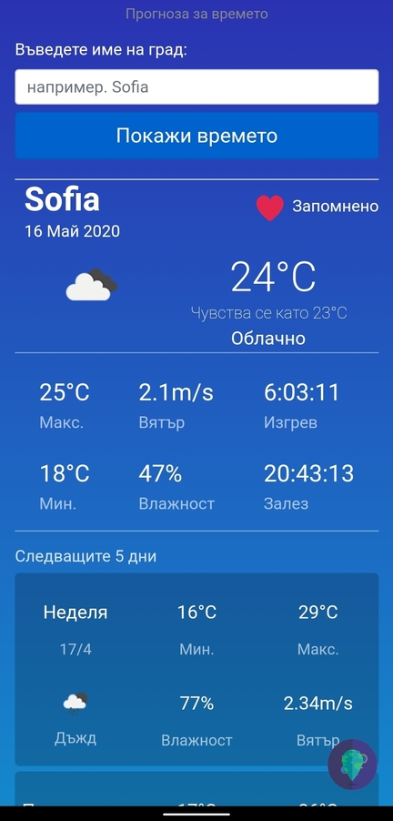

# FindWeather
Find Weather is a mobile application made on Apache Cordova with Javascript to check the weather for today and 5 days later.
It is using the openweathermap's API (https://openweathermap.org/)  
**THE ENTIRE APP IS IN BULGARIAN** - read Info if you wonder why.  



## Info
The purpose of this app creation is term paper for my University in Bulgaria.  
Most of the code is located in file named "weather.js" as the project is small, its development very fast paced and doesn't really have much functions to begin with.  
However some of the implementations I've used, I've found very interesting, and this is the reason why I'm uploading it here.  
Feel free to use it as you see fit!

## Installation
### Run with Visual Studio
You can start it in Visual Studio - either use Google emulator or browser simulation. For this case you need Visual Studio 2017 with module "Mobile applications with Javascript" installed.
### Insert your OpenWeatherMap.org API key
Insert your OpenWeatherMap.org API key in www/scripts/weather.js (first line) and in Merges/iOS/scripts/weather.js (first line), if you'd like to compile it for iOS.

### Compile for Android (or iOS with its command counterparts)
To compile the app you need to have Android SDK (I'm using SDK for Android 8), JDK 8 (my version is Java SE Development Kit 8 Update 251), Gradle (I recommend version 4.4.1 or newer) and Cordova Command-line Interface (npm install -g cordova)
To build Android APK:
First enter folder FindWeather (where you can find www)
Procede to enter following commands in CMD or Powershell:
```Batchfile
cordova platform rm android
cordova platform add android
cordova build android
```
If you don't experience errors with just "cordova build android", you can skip the first two commands. I personally get error message everytime if I don't use them.
You can also use the Batchfile I provided in the repo - BUILD.bat.
You need to run it in the same directory as the .sln file (the current directory)!
It creates folder FindWeather_Build, copies all the files from FindWeather, runs the 3 commands above and copies the resulting .apk file in the same directory.

Update 15.10.2020 - Uh, so I had to work with cordova project again and this time around I had no access to already configured Android SDK by Android Studio, so I had to manually do it myself. Few pointers for future configurations:
1. Download Android SDK Command Line tools (in this case commandlinetools-win-6609375_latest.zip) and unarchive it in any directory (like C:\Android\android-sdk, the hierarchy should end up like this - C:\Android\android-sdk\tools\bin\sdkmanager.bat)
2. Add ANDROID_HOME and ANDROID_SDK_ROOT environmental variables that point to android-sdk directory and also add the tools/bin directory to PATH so you can use sdkmanager from any CMD
3. Execute sdkmanager "platform-tools" "platforms;android-27" "build-tools;29.0.2" --sdk_root="C:\Android\android-sdk"
Where - versions may vary (android-27 is for the current target version of the project, which you can find out by trying to build it, says something like: Cordova Android @8.1.0. Turns out it kinda decides for itself, depending on the configuration that you give it. In my case I was targeting much earlier android version, but Cordova seems to not want to use android-25 anymore..?), build-tools version should mostly be irrelevant as long as Cordova finds it (and not give the following error: No build-tools found, install android build tools minimum 1.19, or something like that), sdk-root is the ANDROID_HOME
4. Execute sdkmanager --update --sdk_root="C:\Android\android-sdk"
just in case
5. Now "cordova build android" should download gradle if it cannot find it already and find build-tools directory in the SDK folder to be able to build the APK. If you get the "build-tools not found" error, try tinkering the versions, make sure you are installing android sdk for the appropriate version that "cordova platform add android" and "cordova build android" say in the console.
Sometimes it really is hard to make it work correctly without already configured Android Studio. Tinkering sdkmanager configuration solved all my problems in this case, but you might also need to tinker the project target versions if they are too outdated.

## Plugins Used

* [pulltorefresh](https://github.com/BoxFactura/pulltorefresh.js)

* [cordova-plugin-request-location-accuracy](https://github.com/dpa99c/cordova-plugin-request-location-accuracy)

* ... and other plugins inside Cordova's default library!

## Others
Great app design thanks to  
* [responsive-web-weather-app](https://github.com/JonUK/responsive-web-weather-app)
